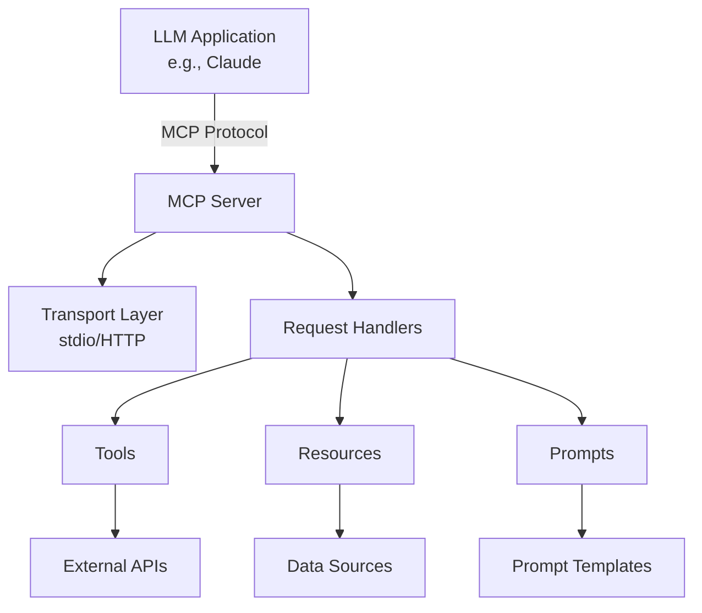

# MCP Server Development Workspace

<a alt="Nx logo" href="https://nx.dev" target="_blank" rel="noreferrer"></a> <a alt="MCP" href="https://github.com/modelcontextprotocol" target="_blank" rel="noreferrer">🤖 MCP</a>

This is an [Nx workspace](https://nx.dev) configured for building **Model Context Protocol (MCP)** servers using TypeScript. MCP servers provide tools, resources, and prompts that can be consumed by LLM applications like Claude.

## 📚 Table of Contents

- [Overview](#overview)
- [Quick Start](#-quick-start)
- [Architecture](#-architecture)
- [Available Scripts](#-available-scripts)
- [Creating MCP Servers](#-creating-mcp-servers)
- [MCP Concepts](#-mcp-concepts)
- [Development Guide](#-development-guide)
- [Testing](#-testing)
- [Deployment](#-deployment)
- [Troubleshooting](#-troubleshooting)
- [Best Practices](#-best-practices)
- [Resources](#-resources)

## Overview

The Model Context Protocol (MCP) is an open protocol that enables seamless integration between LLM applications and external data sources and tools. This workspace provides:

- **TypeScript-first development** with full type safety
- **Nx monorepo benefits** including caching, affected commands, and dependency graph visualization
- **Pre-configured tooling** for building, testing, and deploying MCP servers
- **Generator templates** for quickly scaffolding new servers
- **Best practices** and patterns for MCP development

## 🚀 Quick Start

### Prerequisites

- Node.js 18+ and npm
- Basic understanding of TypeScript
- Familiarity with async/await patterns

### Create Your First MCP Server

```bash
# 1. Install dependencies
npm install

# 2. Generate a new MCP server
npm run mcp:new

# 3. Follow the prompts:
#    - Name: weather-service
#    - Description: Provides weather information
#    - Transport: stdio (recommended for Claude Desktop)

# 4. Start development
cd apps/weather-service
nx serve weather-service

# 5. Build for production
nx build weather-service
```

## 🏗️ Architecture

### Workspace Structure

```
mcp/
├── apps/                      # MCP server applications
│   └── [server-name]/         # Individual MCP server
│       ├── src/
│       │   ├── main.ts        # Server entry point
│       │   ├── handlers/      # Request handlers
│       │   ├── tools/         # Tool implementations
│       │   ├── resources/     # Resource providers
│       │   └── prompts/       # Prompt templates
│       ├── project.json       # Nx project configuration
│       ├── tsconfig.json      # TypeScript config
│       └── README.md          # Server documentation
├── packages/                  # Shared libraries
│   ├── mcp-utils/            # Common MCP utilities
│   └── shared-types/         # Shared TypeScript types
├── tools/
│   └── generators/           # Workspace generators
│       └── mcp-app/         # MCP server generator
├── nx.json                   # Nx workspace config
├── tsconfig.base.json        # Base TypeScript config
└── package.json              # Dependencies & scripts
```

### MCP Server Architecture



## 📜 Available Scripts

### MCP-Specific Commands

| Command | Description |
|---------|-------------|
| `npm run mcp:new` | Generate a new MCP server with interactive prompts |
| `npm run mcp:build` | Build all MCP servers (production) |
| `npm run mcp:dev` | Run all MCP servers in development mode |
| `npm run mcp:test` | Run tests for all MCP servers |
| `npm run mcp:test:watch` | Run tests in watch mode |
| `npm run mcp:lint` | Lint all MCP servers |
| `npm run mcp:typecheck` | Type check all MCP servers |

### Individual Server Commands

```bash
# Run a specific server
nx serve [server-name]

# Build a specific server
nx build [server-name]

# Test a specific server
nx test [server-name]

# Run a built server
node dist/apps/[server-name]/src/main.js
```

### Workspace Commands

```bash
# Visualize project dependencies
npm run graph

# Format code
npm run format

# Check affected projects
npm run affected:test
npm run affected:build
```

## 🛠️ Creating MCP Servers

### Using the Generator

The workspace includes a powerful generator for creating new MCP servers:

```bash
npm run mcp:new
```

The generator will:
1. Prompt for server details (name, description, transport)
2. Create the server structure
3. Set up TypeScript configuration
4. Configure build and test targets
5. Add example implementations
6. Generate comprehensive documentation

### Manual Creation

For advanced use cases, you can create servers manually:

```bash
# 1. Generate the base structure
npx nx g @nx/js:library \
  --name=my-server \
  --directory=apps/my-server \
  --projectNameAndRootFormat=as-provided \
  --bundler=tsc

# 2. Configure as an application
# Update project.json, add main entry point, etc.
```

## 🔍 MCP Concepts

### Tools

Tools are functions that the LLM can invoke to perform actions:

```typescript
// Example: Calculator tool
server.setRequestHandler(CallToolRequestSchema, async (request) => {
  const { name, arguments: args } = request.params;
  
  if (name === 'calculate') {
    const { expression } = args;
    try {
      const result = evaluate(expression);
      return {
        content: [
          {
            type: 'text',
            text: `Result: ${result}`
          }
        ]
      };
    } catch (error) {
      return {
        content: [
          {
            type: 'text',
            text: `Error: ${error.message}`
          }
        ],
        isError: true
      };
    }
  }
});
```

### Resources

Resources provide data that the LLM can read:

```typescript
// Example: Configuration resource
server.setRequestHandler(ListResourcesRequestSchema, async () => {
  return {
    resources: [
      {
        uri: 'config://app/settings',
        name: 'Application Settings',
        description: 'Current application configuration',
        mimeType: 'application/json'
      }
    ]
  };
});

server.setRequestHandler(ReadResourceRequestSchema, async (request) => {
  const { uri } = request.params;
  
  if (uri === 'config://app/settings') {
    return {
      contents: [
        {
          uri,
          mimeType: 'application/json',
          text: JSON.stringify(getSettings(), null, 2)
        }
      ]
    };
  }
});
```

### Prompts

Prompts are reusable templates that guide the LLM:

```typescript
// Example: Code review prompt
server.setRequestHandler(ListPromptsRequestSchema, async () => {
  return {
    prompts: [
      {
        name: 'code-review',
        description: 'Review code for best practices',
        arguments: [
          {
            name: 'language',
            description: 'Programming language',
            required: true
          },
          {
            name: 'code',
            description: 'Code to review',
            required: true
          }
        ]
      }
    ]
  };
});

server.setRequestHandler(GetPromptRequestSchema, async (request) => {
  const { name, arguments: args } = request.params;
  
  if (name === 'code-review') {
    return {
      description: 'Review the provided code',
      messages: [
        {
          role: 'user',
          content: {
            type: 'text',
            text: `Review this ${args.language} code:\n\n${args.code}`
          }
        }
      ]
    };
  }
});
```

## 🔧 Development Guide

### Setting Up Your Development Environment

1. **VS Code Extensions** (recommended):
   - Nx Console
   - TypeScript and JavaScript Language Features
   - ESLint
   - Prettier

2. **Environment Variables**:
   ```bash
   # .env.local (for development)
   MCP_DEBUG=true
   MCP_LOG_LEVEL=debug
   ```

### Development Workflow

1. **Start with the generator**:
   ```bash
   npm run mcp:new
   ```

2. **Implement your server logic**:
   - Define tools in `src/tools/`
   - Add resources in `src/resources/`
   - Create prompts in `src/prompts/`

3. **Run in development mode**:
   ```bash
   nx serve my-server
   ```

4. **Test with the MCP Inspector**:
   ```bash
   npx @modelcontextprotocol/inspector dist/apps/my-server/src/main.js
   ```

### Error Handling

Always implement proper error handling:

```typescript
server.setRequestHandler(CallToolRequestSchema, async (request) => {
  try {
    // Tool implementation
    const result = await performOperation(request.params);
    return {
      content: [{
        type: 'text',
        text: JSON.stringify(result)
      }]
    };
  } catch (error) {
    // Log error for debugging
    server.logger.error('Tool execution failed', { error, request });
    
    // Return user-friendly error
    return {
      content: [{
        type: 'text',
        text: `Operation failed: ${error.message}`
      }],
      isError: true
    };
  }
});
```

### Logging

Use structured logging for better debugging:

```typescript
import { createLogger } from '@mcp/utils';

const logger = createLogger('my-server');

logger.info('Server started', { version: '1.0.0' });
logger.debug('Processing request', { toolName, args });
logger.error('Operation failed', { error, context });
```

## 🧪 Testing

### Unit Testing

Write unit tests for your handlers:

```typescript
// src/tools/calculator.spec.ts
import { describe, it, expect } from 'vitest';
import { calculateHandler } from './calculator';

describe('Calculator Tool', () => {
  it('should add numbers correctly', async () => {
    const result = await calculateHandler({
      name: 'calculate',
      arguments: { expression: '2 + 2' }
    });
    
    expect(result.content[0].text).toBe('Result: 4');
  });
  
  it('should handle errors gracefully', async () => {
    const result = await calculateHandler({
      name: 'calculate',
      arguments: { expression: '1 / 0' }
    });
    
    expect(result.isError).toBe(true);
    expect(result.content[0].text).toContain('Error');
  });
});
```

### Integration Testing

Test the complete server:

```typescript
// src/main.spec.ts
import { spawn } from 'child_process';
import { MCPClient } from '@modelcontextprotocol/sdk/client';

describe('MCP Server Integration', () => {
  let client: MCPClient;
  
  beforeAll(async () => {
    client = await MCPClient.connect({
      command: 'node',
      args: ['dist/apps/my-server/src/main.js']
    });
  });
  
  it('should list available tools', async () => {
    const tools = await client.listTools();
    expect(tools).toContainEqual(
      expect.objectContaining({
        name: 'calculate'
      })
    );
  });
});
```

### Testing Best Practices

1. **Test edge cases**: Empty inputs, large datasets, concurrent requests
2. **Mock external dependencies**: APIs, databases, file systems
3. **Use test fixtures**: Consistent test data across tests
4. **Test error scenarios**: Network failures, invalid inputs, timeouts

## 🚀 Deployment

### Building for Production

```bash
# Build a specific server
nx build my-server --configuration=production

# Build all servers
npm run mcp:build

# Output location
ls dist/apps/my-server/
```

### Deployment Options

#### 1. Claude Desktop Integration

Add to `~/Library/Application Support/Claude/claude_desktop_config.json`:

```json
{
  "mcpServers": {
    "my-server": {
      "command": "node",
      "args": ["/absolute/path/to/dist/apps/my-server/src/main.js"],
      "env": {
        "NODE_ENV": "production"
      }
    }
  }
}
```

#### 2. Docker Deployment

Create a Dockerfile:

```dockerfile
FROM node:18-slim
WORKDIR /app
COPY dist/apps/my-server ./
COPY node_modules ./node_modules
CMD ["node", "src/main.js"]
```

#### 3. Process Manager (PM2)

```bash
# Install PM2
npm install -g pm2

# Start server
pm2 start dist/apps/my-server/src/main.js --name my-mcp-server

# Save configuration
pm2 save
pm2 startup
```

#### 4. Systemd Service

Create `/etc/systemd/system/mcp-server.service`:

```ini
[Unit]
Description=MCP Server
After=network.target

[Service]
Type=simple
User=mcp
WorkingDirectory=/opt/mcp-server
ExecStart=/usr/bin/node /opt/mcp-server/main.js
Restart=on-failure
Environment=NODE_ENV=production

[Install]
WantedBy=multi-user.target
```

## 🐛 Troubleshooting

### Common Issues

#### 1. Server Won't Start

**Problem**: `Error: Cannot find module '@modelcontextprotocol/sdk'`

**Solution**:
```bash
# Ensure dependencies are installed
npm install
# Rebuild the server
nx build my-server --skip-nx-cache
```

#### 2. Transport Issues

**Problem**: "Failed to connect to MCP server"

**Solution**:
- For stdio: Ensure the server outputs to stderr for logs
- For HTTP: Check firewall and port availability
- Verify the server path in configuration

#### 3. Type Errors

**Problem**: TypeScript compilation errors

**Solution**:
```bash
# Update TypeScript references
npx nx sync
# Clear cache and rebuild
nx reset
nx build my-server
```

### Debugging Tips

1. **Enable debug logging**:
   ```typescript
   const server = new Server({
     name: 'my-server',
     version: '1.0.0'
   }, {
     capabilities: { ... },
     logLevel: 'debug'
   });
   ```

2. **Use the MCP Inspector**:
   ```bash
   npx @modelcontextprotocol/inspector \
     node dist/apps/my-server/src/main.js
   ```

3. **Check server output**:
   ```bash
   # Run directly to see all output
   node dist/apps/my-server/src/main.js 2>&1 | tee server.log
   ```

## 💡 Best Practices

### 1. Server Design

- **Single Responsibility**: Each server should focus on one domain
- **Stateless Operations**: Avoid maintaining state between requests
- **Idempotent Tools**: Tools should be safe to retry
- **Clear Naming**: Use descriptive names for tools and resources

### 2. Security

```typescript
// Validate all inputs
const validateInput = (input: unknown): ValidatedInput => {
  if (!isValidInput(input)) {
    throw new Error('Invalid input');
  }
  return input as ValidatedInput;
};

// Sanitize outputs
const sanitizeOutput = (data: any): string => {
  return JSON.stringify(data, null, 2)
    .replace(/api_key":\s*"[^"]+"/g, 'api_key": "***"');
};

// Rate limiting
const rateLimiter = new RateLimiter({
  windowMs: 60 * 1000, // 1 minute
  max: 100 // 100 requests per minute
});
```

### 3. Performance

- **Async Operations**: Use async/await for all I/O operations
- **Streaming Responses**: For large data, use streaming
- **Caching**: Cache expensive computations
- **Connection Pooling**: Reuse database/API connections

### 4. Documentation

Every MCP server should include:
- **README.md**: Overview, installation, usage
- **API.md**: Detailed tool/resource documentation

- **CHANGELOG.md**: Version history and migration guides

## 📚 Documentation

Comprehensive documentation is available in the [`docs/`](./docs/) directory:

### 🚀 Getting Started
- **[Quick Start Tutorial](./docs/getting-started/quick-start-tutorial.md)** - Build your first MCP server in 10 minutes
- **[Core Concepts](./docs/getting-started/core-concepts.md)** - Understanding MCP fundamentals
- **[Setup Guide](./docs/getting-started/setup-guide.md)** - Initial workspace setup and configuration

### 🔧 Development
- **[Development Guide](./docs/development/development-guide.md)** - Complete guide for building MCP servers
- **[API Reference](./docs/reference/api-reference.md)** - Complete MCP SDK API documentation
- **[Quick Reference](./docs/reference/quick-reference.md)** - Common commands and patterns
- **[Scripts Reference](./docs/reference/scripts-reference.md)** - Available npm scripts and commands

### 📖 Examples & Tutorials
- **[Server Examples](./docs/examples/server-examples.md)** - Practical, production-ready examples
- **[Tutorials](./docs/tutorials/)** - Step-by-step guides for common tasks

### 🚀 Deployment & Production
- **[Deployment Guide](./docs/deployment/deployment-guide.md)** - Comprehensive deployment strategies
- **[Claude Desktop Integration](./docs/deployment/claude-desktop-integration.md)** - Setting up servers with Claude
- **[Docker Deployment](./docs/deployment/docker-deployment.md)** - Container deployment guide
- **[Production Checklist](./docs/deployment/production-checklist.md)** - Pre-deployment requirements

### 🏗️ Architecture & Advanced Topics
- **[Architecture Overview](./docs/architecture/architecture-overview.md)** - System design and patterns
- **[Architecture Decision Records](./docs/architecture/decisions/)** - Design decisions and rationale
- **[Advanced Topics](./docs/advanced/advanced-topics.md)** - Streaming, middleware, custom transports

### 🐛 Troubleshooting
- **[Common Issues](./docs/troubleshooting/common-issues.md)** - Frequently encountered problems
- **[Debugging Guide](./docs/troubleshooting/debugging-guide.md)** - Debugging techniques
- **[Error Reference](./docs/troubleshooting/error-reference.md)** - Error codes and solutions

### 🤝 Contributing
- **[Contributing Guidelines](./docs/contributing/)** - How to contribute to the project

### 📊 Project Information
- **[Changelog](./CHANGELOG.md)** - Version history and upgrade guides
- **[Documentation Summary](./docs/DOCUMENTATION_IMPROVEMENTS_SUMMARY.md)** - Overview of documentation structure

📖 **[Browse All Documentation →](./docs/README.md)**

## 📖 Resources

### Official Documentation
- [MCP Specification](https://github.com/modelcontextprotocol/specification)
- [MCP TypeScript SDK](https://github.com/modelcontextprotocol/typescript-sdk)
- [Nx Documentation](https://nx.dev)

### Example Servers
- [MCP Servers Registry](https://github.com/modelcontextprotocol/servers)
- [Official Examples](https://github.com/modelcontextprotocol/typescript-sdk/tree/main/examples)

### Community
- [MCP Discord](https://discord.gg/mcp)
- [GitHub Discussions](https://github.com/modelcontextprotocol/specification/discussions)

### Tools
- [MCP Inspector](https://github.com/modelcontextprotocol/inspector)
- [MCP Client Libraries](https://github.com/modelcontextprotocol/clients)

## 🤝 Contributing

1. **Fork the repository**
2. **Create a feature branch**: `git checkout -b feat/new-server`
3. **Generate your server**: `npm run mcp:new`
4. **Implement and test**: Follow the patterns in this guide
5. **Document thoroughly**: Update all relevant docs
6. **Submit a PR**: Include examples and test results

### Contribution Guidelines

- Follow the existing code style
- Write comprehensive tests
- Update documentation
- Add examples for new features
- Ensure all tests pass
- Keep commits focused and descriptive

---

Built with ❤️ using [Nx](https://nx.dev) and [Model Context Protocol](https://github.com/modelcontextprotocol)
