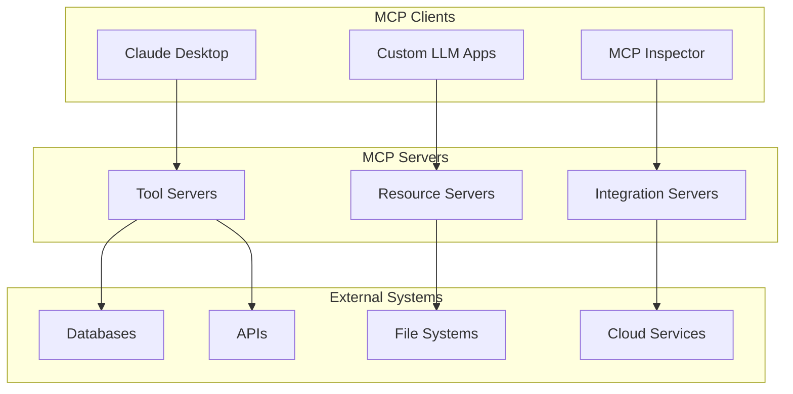
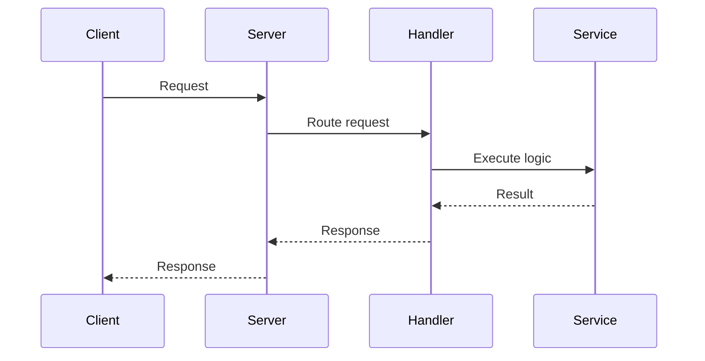
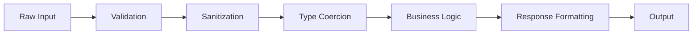
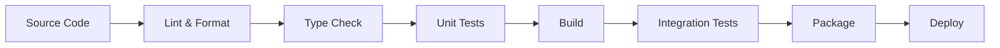
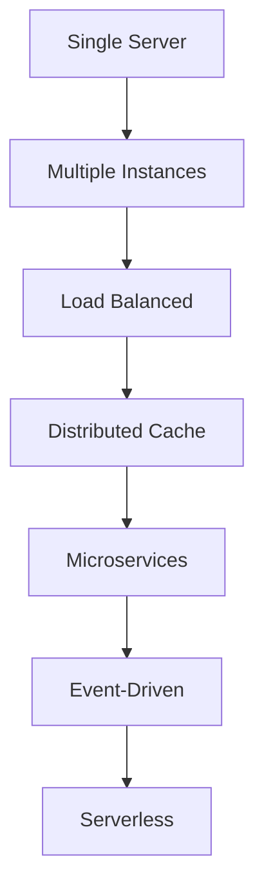

# MCP Workspace Architecture Overview

This document provides a comprehensive overview of the MCP workspace architecture, design patterns, and technical decisions.

## System Architecture

### High-Level Overview



### Workspace Structure

```
mcp/
├── apps/                         # MCP server applications
├── packages/                     # Shared libraries
├── infrastructure/              # Deployment configurations
├── tools/generators/            # Code generators
└── docs/                        # Documentation
```

## Core Components

### 1. MCP Servers (apps/)

Each MCP server is a standalone application that:
- Runs as an independent process
- Communicates via MCP protocol
- Provides specific domain functionality
- Can be deployed separately

**Server Types:**
- **Tool Servers**: Execute actions (calculations, API calls)
- **Resource Servers**: Provide data access (files, databases)
- **Integration Servers**: Bridge to external systems
- **Composite Servers**: Combine multiple capabilities

### 2. Shared Libraries (packages/)

Reusable code shared across servers:

```typescript
// packages/mcp-utils/
export interface MCPServerConfig {
  name: string;
  version: string;
  transport: 'stdio' | 'http' | 'websocket';
  capabilities: ServerCapabilities;
}

// packages/shared-types/
export interface ToolResponse<T = any> {
  content: ContentItem[];
  metadata?: Record<string, any>;
  isError?: boolean;
}
```

### 3. Infrastructure (infrastructure/)

Deployment and operational configurations:
- Docker configurations
- Kubernetes manifests
- Terraform modules
- CI/CD pipelines

### 4. Code Generators (tools/generators/)

Nx generators for scaffolding:
- New MCP servers
- Tools and resources
- Test suites
- Documentation

## Design Patterns

### 1. Handler Pattern

All MCP servers use a consistent handler pattern:

```typescript
// Pattern implementation
export class ToolHandler {
  private tools: Map<string, Tool> = new Map();
  
  register(tool: Tool): void {
    this.tools.set(tool.name, tool);
  }
  
  async handle(request: ToolRequest): Promise<ToolResponse> {
    const tool = this.tools.get(request.name);
    if (!tool) {
      throw new Error(`Unknown tool: ${request.name}`);
    }
    
    return tool.execute(request.arguments);
  }
}
```

### 2. Middleware Chain

Request processing through middleware:

```typescript
export interface Middleware {
  process(
    request: MCPRequest,
    next: () => Promise<MCPResponse>
  ): Promise<MCPResponse>;
}

// Usage
server.use(authenticationMiddleware);
server.use(rateLimitMiddleware);
server.use(loggingMiddleware);
server.use(validationMiddleware);
```

### 3. Resource Provider Pattern

Consistent resource access:

```typescript
export interface ResourceProvider {
  uri: string;
  mimeType: string;
  
  list(): Promise<Resource[]>;
  read(uri: string): Promise<ResourceContent>;
  watch?(uri: string): AsyncIterator<ResourceContent>;
}
```

### 4. Error Handling Strategy

Centralized error handling:

```typescript
export class MCPError extends Error {
  constructor(
    public code: number,
    message: string,
    public data?: any
  ) {
    super(message);
  }
}

// Global error handler
server.setErrorHandler((error, request) => {
  logger.error('Request failed', { error, request });
  
  if (error instanceof MCPError) {
    return {
      error: {
        code: error.code,
        message: error.message,
        data: error.data
      }
    };
  }
  
  // Generic error response
  return {
    error: {
      code: -32603,
      message: 'Internal server error'
    }
  };
});
```

## Communication Patterns

### 1. Request-Response

Standard synchronous pattern:



### 2. Streaming Responses

For large data transfers:

```typescript
export async function* streamLargeDataset(
  query: string
): AsyncGenerator<ContentItem> {
  const cursor = db.query(query);
  
  while (await cursor.hasNext()) {
    const batch = await cursor.next(100);
    yield {
      type: 'text',
      text: JSON.stringify(batch)
    };
  }
}
```

### 3. Resource Subscriptions

Real-time updates:

```typescript
server.setRequestHandler(SubscribeResourceRequestSchema, async (request) => {
  const { uri } = request.params;
  
  return {
    subscription: createResourceWatcher(uri)
  };
});
```

## Data Flow Architecture

### Input Processing Pipeline



### State Management

MCP servers are designed to be stateless, but when state is needed:

```typescript
// In-memory state (for development)
class InMemoryStateManager {
  private state = new Map<string, any>();
  
  async get(key: string): Promise<any> {
    return this.state.get(key);
  }
  
  async set(key: string, value: any): Promise<void> {
    this.state.set(key, value);
  }
}

// Redis state (for production)
class RedisStateManager {
  constructor(private redis: RedisClient) {}
  
  async get(key: string): Promise<any> {
    const value = await this.redis.get(key);
    return JSON.parse(value);
  }
  
  async set(key: string, value: any): Promise<void> {
    await this.redis.set(key, JSON.stringify(value));
  }
}
```

## Security Architecture

### 1. Transport Security

- **stdio**: Process isolation, no network exposure
- **HTTP**: TLS/SSL encryption required
- **WebSocket**: WSS protocol with authentication

### 2. Authentication Layers

```typescript
// API Key Authentication
export class ApiKeyAuth implements AuthProvider {
  async authenticate(request: MCPRequest): Promise<AuthContext> {
    const apiKey = request.headers['x-api-key'];
    const user = await validateApiKey(apiKey);
    return { user, permissions: user.permissions };
  }
}

// JWT Authentication
export class JWTAuth implements AuthProvider {
  async authenticate(request: MCPRequest): Promise<AuthContext> {
    const token = extractBearerToken(request);
    const payload = await verifyJWT(token);
    return { user: payload.user, permissions: payload.permissions };
  }
}
```

### 3. Authorization Model

```typescript
export interface Permission {
  resource: string;
  action: string;
}

export class AuthorizationManager {
  async authorize(
    context: AuthContext,
    required: Permission
  ): Promise<boolean> {
    return context.permissions.some(p => 
      p.resource === required.resource &&
      p.action === required.action
    );
  }
}
```

## Performance Architecture

### 1. Caching Strategy

Multi-level caching:

```typescript
export class CacheManager {
  constructor(
    private l1: MemoryCache,    // Fast, small
    private l2: RedisCache,     // Medium speed, larger
    private l3: DiskCache       // Slow, unlimited
  ) {}
  
  async get(key: string): Promise<any> {
    // Try L1 first
    let value = await this.l1.get(key);
    if (value) return value;
    
    // Try L2
    value = await this.l2.get(key);
    if (value) {
      await this.l1.set(key, value); // Promote to L1
      return value;
    }
    
    // Try L3
    value = await this.l3.get(key);
    if (value) {
      await this.l2.set(key, value); // Promote to L2
      await this.l1.set(key, value); // Promote to L1
      return value;
    }
    
    return null;
  }
}
```

### 2. Connection Pooling

```typescript
export class ConnectionPool<T> {
  private available: T[] = [];
  private inUse = new Set<T>();
  
  async acquire(): Promise<T> {
    if (this.available.length > 0) {
      const conn = this.available.pop()!;
      this.inUse.add(conn);
      return conn;
    }
    
    if (this.inUse.size < this.maxConnections) {
      const conn = await this.createConnection();
      this.inUse.add(conn);
      return conn;
    }
    
    // Wait for available connection
    return this.waitForAvailable();
  }
  
  release(conn: T): void {
    this.inUse.delete(conn);
    this.available.push(conn);
  }
}
```

## Monitoring & Observability

### 1. Metrics Collection

```typescript
export interface MetricsCollector {
  // Counters
  incrementCounter(name: string, labels?: Labels): void;
  
  // Gauges
  setGauge(name: string, value: number, labels?: Labels): void;
  
  // Histograms
  recordHistogram(name: string, value: number, labels?: Labels): void;
  
  // Summaries
  recordSummary(name: string, value: number, labels?: Labels): void;
}
```

### 2. Distributed Tracing

```typescript
export class TracingManager {
  startSpan(name: string, parent?: Span): Span {
    const span = this.tracer.startSpan(name, { parent });
    span.setTag('service', this.serviceName);
    span.setTag('version', this.version);
    return span;
  }
  
  async traceAsync<T>(
    name: string,
    fn: () => Promise<T>
  ): Promise<T> {
    const span = this.startSpan(name);
    try {
      const result = await fn();
      span.setTag('status', 'success');
      return result;
    } catch (error) {
      span.setTag('status', 'error');
      span.setTag('error', error.message);
      throw error;
    } finally {
      span.finish();
    }
  }
}
```

### 3. Health Monitoring

```typescript
export interface HealthCheck {
  name: string;
  check(): Promise<HealthStatus>;
}

export class HealthMonitor {
  private checks: HealthCheck[] = [];
  
  register(check: HealthCheck): void {
    this.checks.push(check);
  }
  
  async getStatus(): Promise<SystemHealth> {
    const results = await Promise.all(
      this.checks.map(async (check) => ({
        name: check.name,
        status: await check.check()
      }))
    );
    
    return {
      status: results.every(r => r.status.healthy) ? 'healthy' : 'unhealthy',
      checks: results
    };
  }
}
```

## Deployment Architecture

### 1. Build Pipeline



### 2. Deployment Targets

- **Local Development**: Direct Node.js execution
- **Desktop Integration**: Claude Desktop config
- **Container**: Docker/Kubernetes
- **Serverless**: AWS Lambda, Vercel
- **Traditional**: PM2, systemd

### 3. Configuration Management

```typescript
export class ConfigurationManager {
  constructor(
    private sources: ConfigSource[]
  ) {}
  
  async load(): Promise<Configuration> {
    // Priority order: Environment > File > Defaults
    const configs = await Promise.all(
      this.sources.map(s => s.load())
    );
    
    return this.merge(configs);
  }
  
  private merge(configs: Configuration[]): Configuration {
    return configs.reduce((acc, config) => 
      deepMerge(acc, config), {}
    );
  }
}
```

## Future Architecture Considerations

### 1. Planned Enhancements

- WebSocket transport implementation
- GraphQL support for complex queries
- Plugin architecture for extensibility
- Distributed server coordination
- Advanced caching strategies

### 2. Scalability Path



### 3. Technology Roadmap

- **Short Term**: Performance optimizations, better TypeScript support
- **Medium Term**: Plugin system, advanced middleware
- **Long Term**: Distributed architecture, multi-region support

## Architecture Decision Records

Important architectural decisions are documented in the [decisions/](./decisions/) directory:

- [ADR-001: Choice of TypeScript](./decisions/001-typescript.md)
- [ADR-002: Nx Monorepo Structure](./decisions/002-nx-monorepo.md)
- [ADR-003: Transport Protocol Support](./decisions/003-transport-protocols.md)
- [ADR-004: Error Handling Strategy](./decisions/004-error-handling.md)

## Related Documentation

- [Design Patterns](./design-patterns.md) - Detailed pattern implementations
- [Component Diagrams](./diagrams/) - Visual architecture representations
- [Performance Guide](../advanced/performance-optimization.md) - Optimization strategies
- [Security Architecture](../advanced/security-best-practices.md) - Security details 