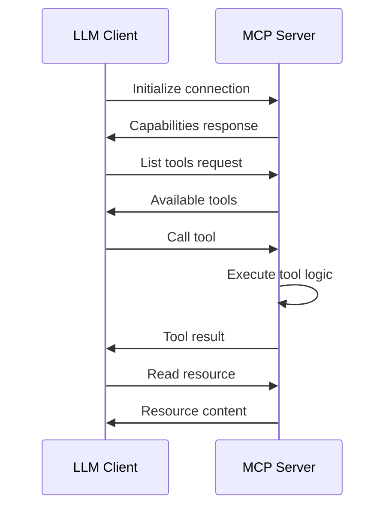

# MCP Core Concepts

Understanding the Model Context Protocol (MCP) is essential for building effective servers. This guide covers the fundamental concepts that power MCP.

## What is MCP?

The Model Context Protocol is an open standard that enables seamless integration between Large Language Models (LLMs) and external systems. It provides a structured way for AI assistants to:

- Access external tools and APIs
- Read from various data sources
- Execute actions on behalf of users
- Maintain context across interactions

## Key Components

### 1. MCP Servers

MCP servers are standalone applications that expose capabilities to LLM clients. They:

- Run as separate processes
- Communicate via standardized transport protocols
- Provide tools, resources, and prompts
- Handle requests asynchronously

```typescript
// Basic server structure
import { Server } from '@modelcontextprotocol/sdk/server/index.js';

const server = new Server({
  name: 'my-server',
  version: '1.0.0'
}, {
  capabilities: {
    tools: {},
    resources: {},
    prompts: {}
  }
});
```

### 2. Tools

Tools are functions that the LLM can invoke to perform actions. They:

- Have defined input schemas
- Return structured responses
- Can be synchronous or asynchronous
- Support error handling

```typescript
// Tool definition
const calculateTool = {
  name: 'calculate',
  description: 'Perform mathematical calculations',
  inputSchema: {
    type: 'object',
    properties: {
      expression: {
        type: 'string',
        description: 'Mathematical expression to evaluate'
      }
    },
    required: ['expression']
  }
};
```

**Key characteristics:**
- **Stateless**: Each tool call is independent
- **Deterministic**: Same inputs produce same outputs
- **Safe**: Tools should validate inputs and handle errors
- **Descriptive**: Clear names and descriptions for LLM understanding

### 3. Resources

Resources provide data that the LLM can read. They:

- Have unique URIs
- Support different MIME types
- Can be static or dynamic
- Enable data access without tool calls

```typescript
// Resource example
{
  uri: 'config://app/settings',
  name: 'Application Settings',
  description: 'Current application configuration',
  mimeType: 'application/json'
}
```

**Common resource patterns:**
- Configuration files
- Database records
- API responses
- File contents
- System information

### 4. Prompts

Prompts are reusable templates that guide LLM behavior. They:

- Accept arguments for customization
- Return structured message formats
- Encapsulate complex instructions
- Promote consistency

```typescript
// Prompt definition
{
  name: 'code-review',
  description: 'Review code for best practices',
  arguments: [
    {
      name: 'language',
      description: 'Programming language',
      required: true
    }
  ]
}
```

## Transport Protocols

MCP supports multiple transport mechanisms:

### stdio (Standard I/O)
- **Use case**: Local desktop applications (e.g., Claude Desktop)
- **Benefits**: Simple, secure, no network exposure
- **Format**: JSON-RPC over stdin/stdout

```typescript
// stdio transport setup
const transport = new StdioServerTransport();
await server.connect(transport);
```

### HTTP/SSE
- **Use case**: Web applications, remote access
- **Benefits**: Firewall-friendly, standard web protocols
- **Format**: HTTP POST for requests, SSE for server-initiated messages

```typescript
// HTTP transport setup
const transport = new HttpServerTransport({
  port: 3000,
  path: '/mcp'
});
```

### WebSocket (Future)
- **Use case**: Real-time bidirectional communication
- **Benefits**: Low latency, efficient for frequent updates
- **Status**: Planned for future implementation

## Request/Response Flow

Understanding the MCP communication flow is crucial:



## Message Format

MCP uses JSON-RPC 2.0 for message formatting:

### Request
```json
{
  "jsonrpc": "2.0",
  "id": "unique-id",
  "method": "tools/call",
  "params": {
    "name": "calculate",
    "arguments": {
      "expression": "2 + 2"
    }
  }
}
```

### Response
```json
{
  "jsonrpc": "2.0",
  "id": "unique-id",
  "result": {
    "content": [
      {
        "type": "text",
        "text": "4"
      }
    ]
  }
}
```

### Error Response
```json
{
  "jsonrpc": "2.0",
  "id": "unique-id",
  "error": {
    "code": -32602,
    "message": "Invalid params",
    "data": {
      "details": "Expression cannot be empty"
    }
  }
}
```

## Content Types

MCP supports various content types in responses:

### Text Content
```typescript
{
  type: 'text',
  text: 'Hello, world!'
}
```

### Image Content
```typescript
{
  type: 'image',
  data: 'base64-encoded-image-data',
  mimeType: 'image/png'
}
```

### Tool Response Content
```typescript
{
  type: 'resource',
  resource: {
    uri: 'file:///path/to/document.pdf',
    mimeType: 'application/pdf',
    text: 'PDF content as text'
  }
}
```

## Capabilities

Servers declare their capabilities during initialization:

```typescript
{
  capabilities: {
    tools: {},        // Server provides tools
    resources: {      // Server provides resources
      subscribe: true // Supports resource subscriptions
    },
    prompts: {},      // Server provides prompts
    logging: {}       // Server supports logging
  }
}
```

## Error Handling

MCP defines standard error codes:

- **-32700**: Parse error
- **-32600**: Invalid request
- **-32601**: Method not found
- **-32602**: Invalid params
- **-32603**: Internal error
- **-32000 to -32099**: Server-defined errors

```typescript
// Error handling example
try {
  const result = await executeOperation();
  return { content: [{ type: 'text', text: result }] };
} catch (error) {
  return {
    content: [{ 
      type: 'text', 
      text: `Error: ${error.message}` 
    }],
    isError: true
  };
}
```

## Best Practices

### 1. Design Principles
- **Focused servers**: One domain per server
- **Clear boundaries**: Well-defined tool responsibilities
- **Composability**: Tools that work well together

### 2. Security
- **Input validation**: Always validate tool inputs
- **Sandboxing**: Limit file system and network access
- **Authentication**: Implement when needed
- **Rate limiting**: Prevent abuse

### 3. Performance
- **Async operations**: Don't block the event loop
- **Streaming**: Use for large responses
- **Caching**: Cache expensive operations
- **Resource limits**: Set timeouts and memory limits

### 4. User Experience
- **Descriptive names**: Help LLMs understand capabilities
- **Good error messages**: Provide actionable feedback
- **Progress indicators**: For long-running operations
- **Consistent patterns**: Follow MCP conventions

## Summary

MCP provides a powerful framework for extending LLM capabilities. By understanding these core concepts:

- **Servers** expose capabilities
- **Tools** perform actions
- **Resources** provide data
- **Prompts** guide interactions
- **Transports** enable communication
- **Standards** ensure interoperability

Ready to build? Continue with:
- [Quick Start Tutorial](./quick-start-tutorial.md) - Build your first server
- [Development Guide](../development/development-guide.md) - Deep dive into development
- [API Reference](../reference/api-reference.md) - Complete API documentation 